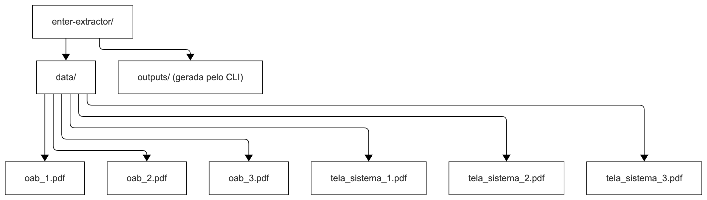
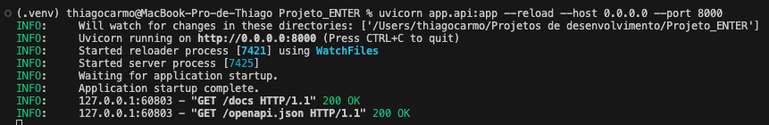
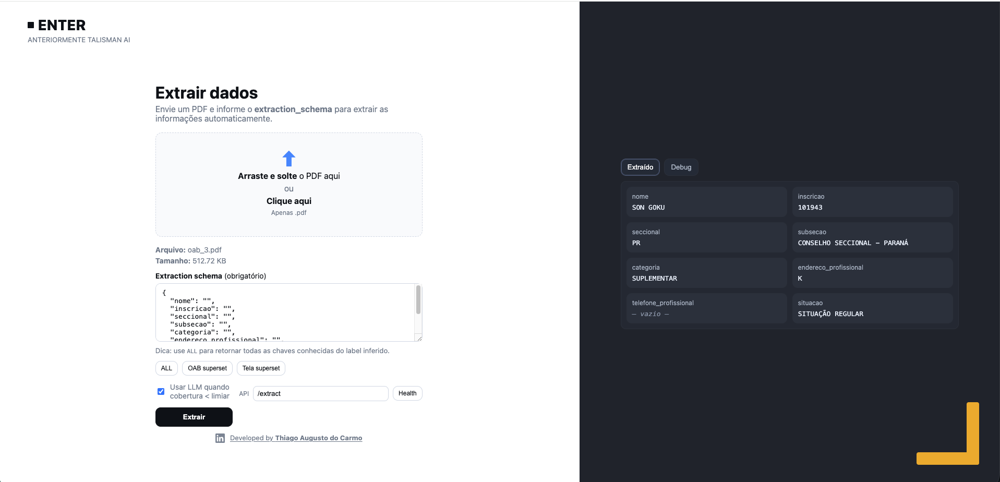
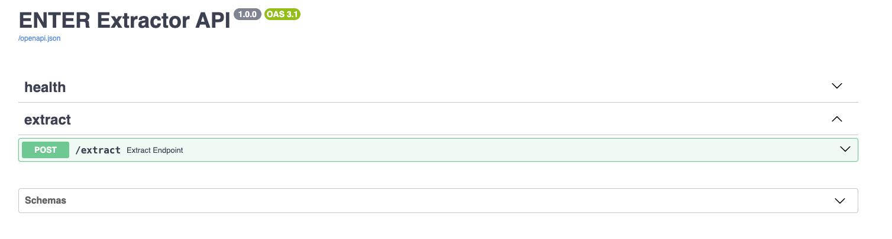

# Projeto ENTER · Extração Estruturada de PDFs (OAB & Telas de Sistema) 

**Objetivo:** Criar uma solução capaz de extrair informações estruturadas de arquivos PDF de forma **síncrona** e com o melhor **custo-benefício** e **acurácia** possível.

**Resumo:** Prezados(as), a solução aqui desenvolvida realiza extração estruturada de PDFs com foco em acurácia, previsibilidade de execução e baixo custo operacional. O processo inicia pela **detecção automática do layout** (v1/v2/v3) e, a partir dessa pista, aciona um **pipeline em camadas** que combina:  
- **expressões regulares tolerantes**,  
- **âncoras semânticas** por vizinhança textual,  
- **normalização** (acentos, espaços, pontuação, formatos brasileiros).

Somente quando a **cobertura** medida fica abaixo de um **limiar** definido um **LLM** é chamado como alternativa, preservando orçamento e mantendo comportamento determinístico na maioria dos casos. A solução atende dois cenários principais: **carteiras OAB** e **telas de sistema**, mantendo **independência do nome do arquivo** — a decisão é sempre tomada pelo **conteúdo** (texto embutido; se ausente, **OCR** pode ser usado conforme configuração). A saída é um **JSON explicável**, com metadados que permitem auditoria: cobertura por layout, indícios textuais que motivaram a escolha e indicação transparente de eventual uso de LLM.

Além do pipeline, o projeto inclui **CLI** e **API (FastAPI)**, permitindo tanto operações locais em lote quanto integração por HTTP. O chamador pode trabalhar com **schemas padrão por label** (OAB ou `tela_sistema`) ou informar um **subset de chaves** de interesse; a **ordem enviada é preservada** e campos não localizados retornam string vazia.

Para reduzir **tempo e custo** em execuções repetidas, há um **cache determinístico** baseado em três elementos: **hash do PDF**, **schema normalizado** e **versão do extrator**. Se os três coincidirem, o resultado é imediatamente reutilizado — algo especialmente valioso quando o LLM seria acionado. O cache possui **diretório**, **política de expiração (TTL)** e **“sal” de versão** (Um parenteses rapido: SAL ou em inglês SALT, é um valor extra (ex.: hash curto do código/regra de extração, número de release, timestamp controlado) que você mistura à chave do cache para invalidar entradas antigas quando muda algo relevante (regras, normalizadores, parsing). Perceba que não é nada secreto; serve só para cache busting, e só!) configuráveis, facilitando invalidar entradas sempre que regras de extração ou normalização forem alteradas.

O design privilegia clareza e manutenção: componentes separados para **leitura de PDF/OCR**, **detecção de layout**, **casamento de campos**, **normalizadores**, **orquestração**, **cliente LLM** e **cache**. Essa organização torna simples **estender campos**, **acrescentar sinônimos**, **adaptar padrões regionais** (endereços/telefones) ou **introduzir novos templates**. Em conjunto, esses elementos oferecem um caminho consistente para extrair informação com **qualidade**, **previsibilidade** e **controle de custos**, do notebook local a serviços em produção.

## 1 Desafios mapeados - decisões - soluções

### 1.0 Fallback LLM - Configuração do arquivo .env

Para ativar o fallback por LLM quando a cobertura < limiar:

EXTRACT_USE_LLM=1           
LLM_PROVIDER=openai         # openai | anthropic | azure_openai
LLM_MODEL=gpt-5-mini        # ID exato do modelo no provedor
LLM_API_KEY=coloque_sua_chave_aqui. 
EXTRACT_USE_LLM=1

Obs.: O arquivo já está no formato, so insira a chave da API sem espaços. 
Exemplo: LLM_API_KEY=**k-svcacct-PZPkNEhlJ......**

### 1.1 Variedade de layouts e baixa padronização
**Desafio:** fontes com layouts diferentes (e.g., `tela_sistema_1.pdf`, `tela_sistema_2.pdf`, `tela_sistema_3.pdf`, carteiras OAB de formatos variados).
**Decisão:** **detectar o layout antes de extrair**.
**Solução:**
  Detector **híbrido v1/v2/v3** com:
    Heurísticas de cobertura por **âncoras** (palavras-chave, padrões visuais e campos esperados).
    `per_layout` com **scores** e escolha por **coverage** acima de `threshold`.
    **Fallback inteligente:** se nenhum layout atingir o limiar, usa modo **flexível** e, se necessário, **LLM** apenas para campos ambíguos.
  **Explicabilidade:** retornamos `debug.per_layout`, `threshold`, `detected_hint` e flag `llm_requested`.

### 1.2 Sensibilidade ao nome do arquivo
**Desafio:** inferências enviesadas pelo nome (ex.: sufixos `_1`, `_2`, `_3`).
**Decisão:** **ignorar completamente o nome do arquivo**.
**Solução:** toda inferência vem do **conteúdo** (texto embutido + estrutura). Validado renomeando os PDFs.

### 1.3 Campos com padrões frágeis (regex “quebradiço”)
**Desafio:** pequenas variações de tipografia/acentos quebram a extração.
**Decisão:** **extratores composicionais** em múltiplas rotas:
  1. Regex **tolerante** (acentos, espaços, prefixos).
  2. **Âncoras semânticas** (janela de contexto).
  3. **Normalização** (NFKD, espaços, pontuação).
  4. **Fallback LLM** apenas se as rotas anteriores não atingirem confiança mínima.
**Solução:** cada campo retorna **confiança** e, no `debug`, a **rota vencedora**.

### 1.4 PDFs “desenhados” vs. textuais
**Desafio:** PDFs imagem sem camada de texto.
**Decisão:** **pipeline adaptativo**: tenta texto; se vazio, ativa OCR.
**Solução:** camada de **OCR** (configurável) + normalização pós-OCR.

### 1.5 Transparência e auditabilidade
**Desafio:** justificar escolhas para QA/evolução.
**Decisão:** resposta sempre com **metadados de decisão**.
**Solução:** `debug` inclui `layout_final`, `coverage.before/after`, `per_layout`, `detected_hint`, `llm_requested`.

## 2 O que foi endereçado nesta versão
Procurei atender com precisão a todos os requisitos de avaliação sendo estes:
**Detecção de layout** (v1/v2/v3) com pontuação e threshold.  
**Extração robusta** para:
  **Carteira OAB:** `nome`, `inscricao`, `seccional`, `subsecao`, `categoria`, `endereco_profissional`, `telefone_profissional`, `situacao`.
  **Tela de Sistema:** `pesquisa_por`, `pesquisa_tipo`, `sistema`, `valor_parcela`, `cidade`.
**Independência do nome do arquivo**.  
**Resposta explicável** (debug completo).  
**API FastAPI** com upload/rota JSON.  
**Testes** com PDFs de exemplo e **schema de saída padronizado**.

**Backlog curto:** dicionário de sinônimos regionais (endereços/telefones), classificador visual leve p/ subtipos OAB e avaliador de qualidade (precision/recall por campo).

## 3 Como funciona (visão rápida)

1. **Entrada:** PDF (upload) ou caminho local.  
2. **Pré-processamento:** detecta se há texto; se não, roda **OCR**.  
3. **Detecção de Layout:** calcula **coverage** por `v1`, `v2`, `v3`; escolhe `layout_final`.  
4. **Extração por Campo:** aplica **rotas** (regex -> âncoras -> normalização -> LLM fallback).  
5. **Normalização** (telefone, endereço, categoria).  
6. **Saída:** JSON com `label`, `extraction_schema`, `pdf_path` e `debug`.

## 4 Como usar — **CLI** e **API**

Coloque seus PDFs em `./data/`.

### 4.1 Estrutura esperada da pasta `data/`
Para executra de acordo com o  **9.4 API — Execute no terminal**, a estrutura de pasta a baixo deve existir na raiz do projeto (Pasta Data, com os arquivos dentro **.pdf**).

**Onde colocar os arquivos:** copie seus PDFs para `./data/`.  
**Nomes dos arquivos:** **não influenciam** a detecção de layout.  
**`outputs/`:** o CLI cria (se não existir) e grava os resultados lá.

### 4.2 Rodando **somente o CLI**

**Instale as dependências:**

pip install -r requirements.txt
**Comandos comuns:**
#### 1 Um único PDF - saída no terminal (stdout)
python cli.py --pdf data/oab_1.pdf
#### 2 Vários PDFs por padrão/curinga - salva JSON único
python cli.py --dir data --pattern "oab_*.pdf" \
  --out data/outputs/oab_results.json --pretty
#### 3 Processar todo o diretório data/ e salvar um JSON por arquivo
python cli.py --dir data --split-out data/outputs
#### 4 Forçar OCR (caso seus PDFs sejam imagens) e desativar fallback LLM
python cli.py --dir data --enable-ocr --disable-llm --out data/outputs/run.json

**Parâmetros do cli.py:**
--pdf PATH — processa um único PDF.
--dir DIR — processa todos os PDFs do diretório.
--pattern GLOB — ex.: "oab_*.pdf", "*.pdf" (com --dir).
--out FILE — grava um JSON consolidado.
--split-out DIR — grava um JSON por PDF em DIR.
--enable-ocr / --disable-ocr — liga/desliga OCR.
--disable-llm — evita fallback LLM.
--pretty — formata o JSON.
--log-level INFO|DEBUG — verbosidade.

**Saída típica por arquivo:**

{
  "ok": true,
  "label": "tela_sistema",
  "extraction_schema": { "pesquisa_por": "Tipo", "pesquisa_tipo": "Sistema", "sistema": "Contrato", "valor_parcela": "", "cidade": "" },
  "pdf_path": "tela_sistema_31.pdf",
  "debug": {
    "layout_final": "v2",
    "coverage": { "threshold": 0.9, "before": 0.6, "after": 0.6 },
    "llm_requested": true,
    "per_layout": { "v1": 0.14285714285714285, "v2": 0.6, "v3": 0 }
  }
}

**Como tenho usado mac fica a dica caso o sistema ao qual iram roda seja windos:**

Windows PowerShell: ajuste aspas, ex.: --pattern "*.pdf".

Se algum PDF não tiver texto, use --enable-ocr.

## 4.3 Subindo a API FastAPI
**Instale as dependências:**
Primeiro Crie um Ambiente virtual 
python -m venv venv sendo o segundo argumento venv o nome do ambiente.
Na sequencia ative o ambinete: caso MAC ou linux "source <nome_do_ambiente>/bin/activate" e  ou windows <nome_do_ambiente>\Scripts\Activate.ps1 ou <nome_do_ambiente>\Scripts\activate.bat (PowerShell ou CMD respectivamente). 
Depois use o comando a seguir para intalar as libs do projeto.
pip install -r requirements.txt

**Suba o servidor:**
uvicorn app.api:app --reload --host 0.0.0.0 --port 8000

**Acesse no navegador:**
Swagger (interativo): http://localhost:8000/docs#/

ReDoc (documentação): http://localhost:8000/redoc

UI simples (se habilitada): http://localhost:8000/ui

# 5 Esquemas padrão (quando o cliente NÃO envia extraction_schema)
## 5.1 carteira_oab (superset fixo)
{
  "nome": "",
  "inscricao": "",
  "seccional": "",
  "subsecao": "",
  "categoria": "",
  "endereco_profissional": "",
  "telefone_profissional": "",
  "situacao": ""
}

## 5.2 tela_sistema — Superset (todas as chaves conhecidas)
{
  "data_referencia": "",
  "selecao_de_parcelas": "",
  "total_de_parcelas": "",
  "pesquisa_por": "",
  "pesquisa_tipo": "",
  "sistema": "",
  "valor_parcela": "",
  "cidade": "",
  "data_base": "",
  "data_verncimento": "",
  "quantidade_parcelas": "",
  "produto": "",
  "tipo_de_operacao": "",
  "tipo_de_sistema": ""
}

**Observação (modo padrão):** a resposta usa o superset por label.
O layout (v1/v2/v3) é usado apenas para métrica de cobertura e acionar fallback LLM, sem recortar a saída.

# 6 Informando o extraction_schema (subset de campos)
A API/CLI aceita que você informe apenas as chaves que deseja extrair para um dado label.
Isso permite usar a solução sem conhecer o schema completo do label — você só pede o subset necessário.

**Regras:**
Envie um objeto JSON (valores são ignorados; usamos só os nomes das chaves).
As chaves solicitadas devem existir no superset do label (ver seção acima).
A ordem das chaves enviadas é preservada na resposta.
Campos não encontrados retornam "" (detalhes em debug, se habilitado).

**API — exemplos (cURL):**
**Tela de Sistema (subset)**
curl -X POST "http://localhost:8000/extract" \
  -F 'file=@data/tela_sistema_1.pdf' \
  -F 'extraction_schema={"pesquisa_por":"","sistema":"","valor_parcela":""}'

**Carteira OAB (subset)**
curl -X POST "http://localhost:8000/extract" \
  -F 'file=@data/oab_1.pdf' \
  -F 'extraction_schema={"nome":"","inscricao":"","situacao":""}'

**Sem extraction_schema - usa o superset padrão**
curl -X POST "http://localhost:8000/extract" \
  -F "file=@data/tela_sistema_2.pdf"
CLI — exemplos:

**Um PDF, subset OAB**
python cli.py --pdf data/oab_1.pdf \
  --extraction-schema '{"nome":"", "inscricao":"", "situacao":""}'

**Diretório inteiro, subset tela_sistema, JSON único**
python cli.py --dir data --pattern "tela_sistema_*.pdf" \
  --extraction-schema '{"pesquisa_por":"", "sistema":"", "valor_parcela":""}' \
  --out data/outputs/telas_subset.json --pretty
Windows/PowerShell: use aspas duplas fora e escape internamente, ex.:
-F "extraction_schema={\"nome\":\"\",\"inscricao\":\"\"}"

# 7 UI Web 

A UI do projeto foi pensada para **testar a extração** sem precisar de cURL ou scripts.  
Ela fica em: **http://localhost:8000/ui** (quando o servidor FastAPI está rodando).

## 7.1 Como usar
1. **Abra** `http://localhost:8000/ui`.
2. **Envie o PDF**:
   - **Desktop:** arraste e solte o arquivo na **dropzone** (toda a área é clicável; o input nativo fica oculto).
   - **Mobile:** toque na dropzone e selecione o arquivo (em telas pequenas pode aparecer um botão “Selecionar arquivo” interno).
3. (Opcional) **Usar LLM quando cobertura < limiar**: marque/desmarque o **checkbox** para permitir o fallback LLM quando a cobertura medida ficar abaixo do limiar configurado.
4. Clique em **Extrair**.
5. Veja os resultados na aba **“Extraído”**; troque para **“Debug”** para inspecionar decisões (layout, coverage, uso de LLM, etc.).

Dica: a **barra de progresso** indica upload/processamento. Abaixo da dropzone a UI mostra **nome** e **tamanho** do arquivo selecionado.

## 7.2 Anatomia rápida
- **Dropzone:** área central para arrastar/soltar ou clicar e escolher PDF.  
- **Checkbox “Usar LLM …”:** espelha o parâmetro `use_llm` do endpoint `/extract`.  
- **Extrair:** dispara POST para `/extract`.  
- **Aba “Extraído”:** renderiza `extraction_schema` como **pares chave–valor**.  
- **Aba “Debug”:** mostra `debug` (quando `API_DEBUG=1`) com `layout`, `coverage`, `llm_requested`, etc.

Observação: elementos como **campo “API base”** e **botão Health** podem estar comentados no HTML. Se habilitados, permitem testar `/health` e apontar a UI para um backend diferente (ex.: staging).

## 7.3 Teclado & acessibilidade
- **Tab/Enter** navegam pela UI; a dropzone tem **foco visível**.
- A dropzone inteira é **clicável**.
- Mensagens de **erro** aparecem dentro do painel principal.

## 7.4 Mensagens comuns
- **“Erro ao enviar”**: verifique se o **backend** está ativo (veja também o console do navegador) e se o **CORS** permite a origem da UI.
- **“Sem debug retornado …”**: habilite `API_DEBUG=1` no `.env` para retornar o bloco `debug`.

## 7.5 Configurações úteis para a UI
No `.env` do backend:

# habilita debug estruturado no /extract
API_DEBUG=1

**habilita LLM por padrão (pode ser sobrescrito pelo checkbox da UI)**
EXTRACT_USE_LLM=1

**limiar de cobertura que decide o fallback LLM**
EXTRACT_MIN_COVERAGE=0.90

**CORS (se for servir a UI em outra origem)**
CORS_ALLOW_ORIGINS=*
Se a UI for servida de outro host/porta (ex.: Next.js dev server), ajuste CORS_ALLOW_ORIGINS (por exemplo, http://localhost:3000).

## 7.6 Limitações e notas
Somente PDF (uma página, com OCR embutido).

O input nativo de arquivo fica oculto no desktop; no mobile pode existir um botão visível dentro da dropzone para facilitar o toque.

Tamanho máximo do upload depende do servidor/infra (ex.: proxies, reverse proxy).

A UI envia sempre file e, se o checkbox estiver marcado, use_llm=true. O extraction_schema (subset de chaves) não é configurável pela UI por padrão — use cURL/CLI se precisar informar um schema customizado.

## 7.7 Personalização visual
Logo/branding: altere os seletores .brand, .logo-mark, .logo-text no index.html e as cores no styles.css.

Ocultar botão “Selecionar arquivo”: no desktop ele já fica oculto; para esconder também no mobile, remova o elemento do HTML ou aplique display: none ao seletor específico usado no seu tema (ex.: .only-mobile).

# 8 Estrutura sugerida do projeto

# 9 Exemplos end-to-end rápidos
## 9.1 CLI — processar tudo e salvar UM JSON
python cli.py --dir data --pattern "*.pdf" --out data/outputs/all_results.json --pretty

## 9.2 CLI — um JSON por arquivo
python cli.py --dir data --split-out data/outputs --enable-ocr

## 9.3 API — subir e testar via Swagger
uvicorn app.api:app --reload
**Abra http://localhost:8000/docs#/**

## 9.4 API — Execute no terminal
ORCH_VERBOSE=1 EXTRACT_USE_LLM=1 \

python -m app.cli "./data" "./outputs/consolidado_filled.json" --mode=filled

python -m tools.evaluate ./outputs/consolidado_filled.json ./data --verbose

**Obrigado!**